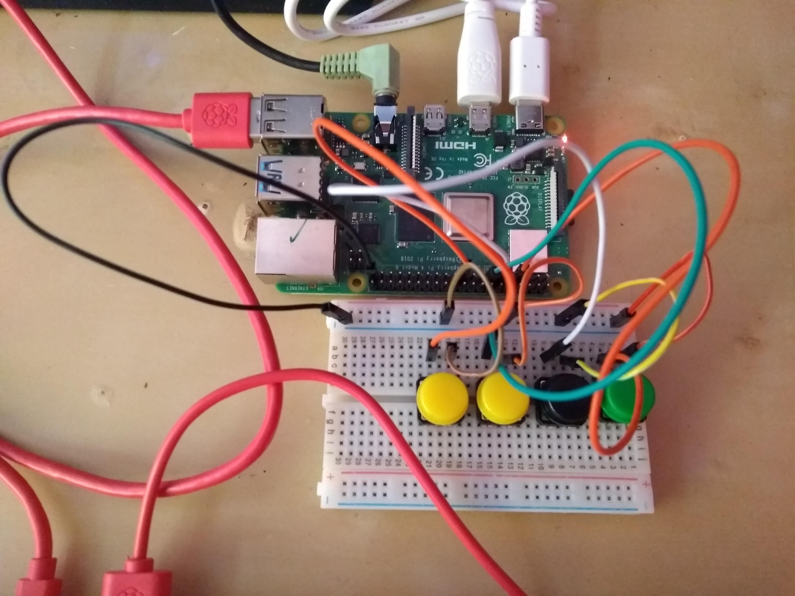

## What you will make

In this project, you will build a button-controlled "music box" that plays different sounds when different buttons are pressed. You can find a shortened version of this project on [YouTube](https://www.youtube.com/watch?v=2izvSzQWYak&feature=youtu.be)

--- no-print ---
<iframe width="560" height="315" src="https://www.youtube.com/embed/2izvSzQWYak" frameborder="0" allow="accelerometer; autoplay; encrypted-media; gyroscope; picture-in-picture" allowfullscreen></iframe>
--- /no-print ---

### What you will make

--- no-print ---
<video width="640" height="360" controls>
<source src="images/gpio-music-box-final.webm" type="video/webm">
Your browser does not support WebM video — try Firefox or Chrome.
</video>
--- /no-print---

--- print-only ---

--- /print-only ---

--- collapse ---
---
title: What you will learn
---
- Play sounds in Python with `pygame`
- Use the Python `gpiozero` library to connect button presses to function calls
- Use the dictionary data structure in Python
--- /collapse ---

--- collapse ---
---
title: What you will need
---

### Hardware
- A Raspberry Pi computer
- A breadboard
- Four (4) tactile switches (to make buttons)
- Five (5) pin-to-socket jumper leads
- Four (4) pin-to-pin jumper leads
- Speakers or headphones

### Software
- The latest version of the [Raspbian](https://www.raspberrypi.org/downloads/raspbian/) operating system
--- /collapse ---

--- collapse ---
---
title: Additional information for educators
---

If you need to print this project, please use the [printer-friendly version](https://projects.raspberrypi.org/en/projects/gpio-music-box/print){:target="_blank"}.

You can [find the solution for this project here](https://rpf.io/p/en/gpio-music-box-get){:target="_blank"}.
--- /collapse ---

