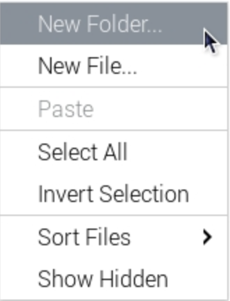
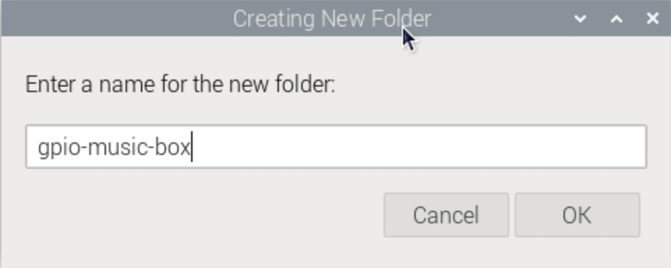
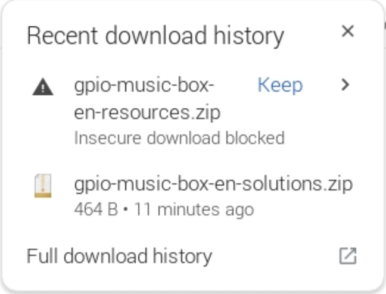
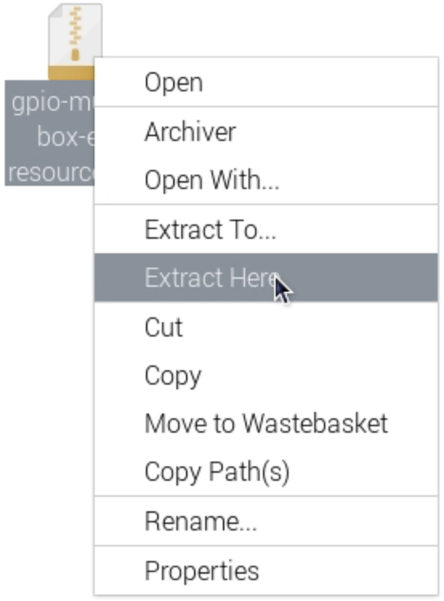
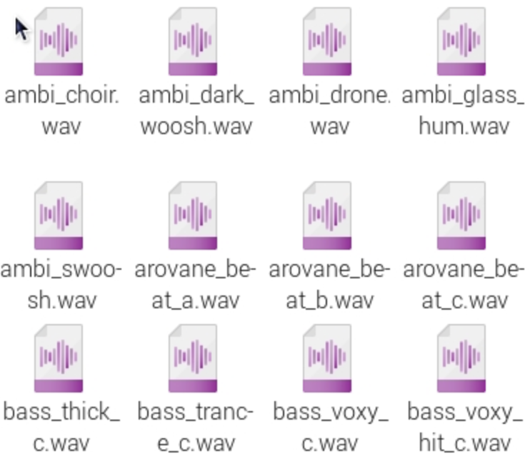

## Set up your project

You will need some sample sounds for this project.

--- task ---

In your `home` folder, right-click to create a folder called `gpio-music-box`.

--- /task ---

### Download the samples

--- task ---

In a browser, go to [rpf.io/p/en/gpio-music-box-go](http://rpf.io/p/en/gpio-music-box-go){:target="_blank"}

You might need to tell the browser to **Keep** the downloaded file.

--- /task ---

--- task ---

Move the downloaded `gpio-music-box-en-resources.zip` into your `gpio-music-box` folder

--- /task ---

--- task ---

In your `gpio-music-box` folder, right click on the `.zip` file and select **Extract Here**.

--- /task ---

Once completed, you should see all the `.wav` files in your folder.

