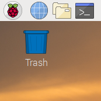
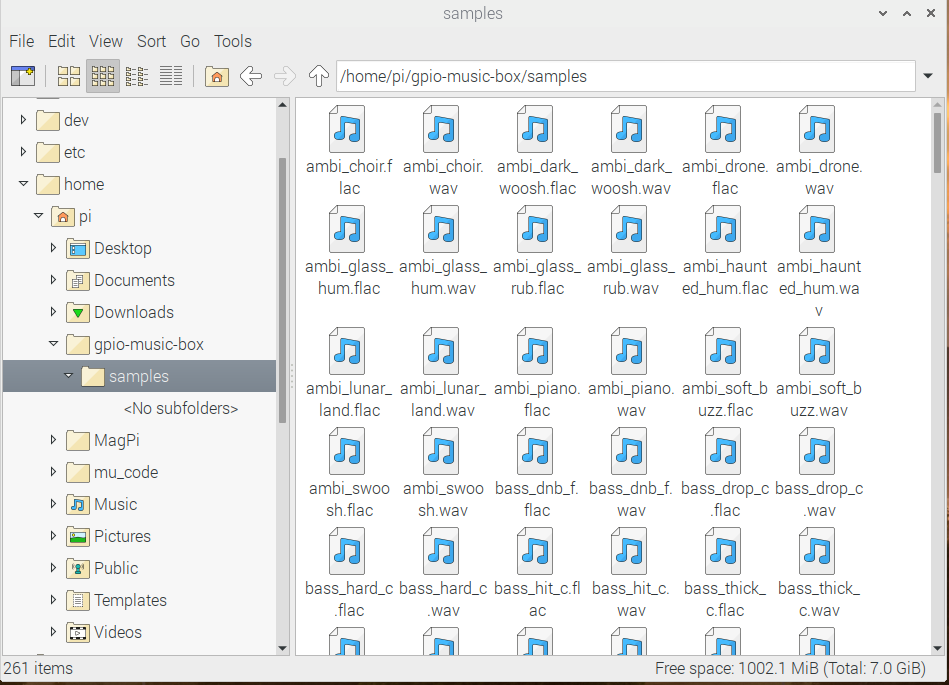

## Set up your project

You will need some sample sounds for this project. There are lots of sound files on Raspbian, but it can be a bit difficult to play them using Python. However, you can convert the sound files to a different file format that you can use in Python more easily.

--- task ---
First, in your `home` directory, create a directory called `gpio-music-box`. You will use the new directory to store all your files for the project.
--- /task ---

[[[rpi-gui-creating-directories]]]

### Copy the sample sounds

--- task ---
Using the same method as before, create a new directory called `samples` in your `gpio-music-box` directory.
--- /task ---

There are lots of sample sounds stored in `/usr/share/sonic-pi/samples`. In the next step, you will copy these sounds into the `gpio-music-box/samples` directory.

--- task ---
Click on the icon in the top left-hand corner of your screen to open a terminal window.

--- /task ---

--- task ---
Type the following lines to copy all the files from one directory to the other:

```bash
cp /usr/share/sonic-pi/samples/* ~/gpio-music-box/samples/.
```
--- /task ---

When you have done that, you should be able to see all the `.flac` sound files in the `samples` directory.


### Convert the sound files

To play the sound files using Python, you need to convert the files from `.flac` files to `.wav` files.

--- task ---
In a terminal, change into your `samples` directory.

```bash
cd ~/gpio-music-box/samples
```
--- /task ---

If you want to learn more about converting media files and running commands on multiple files, look at the two sections below.

[[[nix-bash-convert-media-files]]]

[[[nix-bash-batch-operations-on-files]]]

--- task ---
In your terminal, type the following commands. This will convert all the `.flac` files to `.wav` files, then delete the old files.

```bash
for f in *.flac; do ffmpeg -i "$f" "${f%.flac}.wav"; done
rm *.flac
```

It will take a minute or two, depending on the Raspberry Pi model that you are using.
--- /task ---

You should now be able to see all the new `.wav` files in the `samples` directory.


