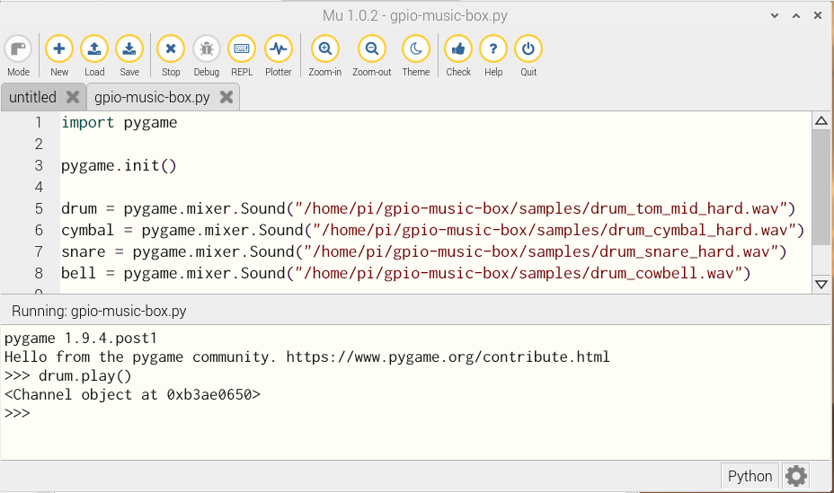

## Play sounds

Next, you will start to write your Python code. You can use any text editor or IDE to do this — Mu is always a good choice.


To start to create the instruments of your music box, you need to test whether Python can play some of the samples that you have copied.

[[[generic-python-playing-sound-files]]]

--- task ---
First, import and initialise the `pygame` module for playing sound files.

```python
import pygame

pygame.init()
```
--- /task ---

--- task ---
Save this file in your `gpio-music-box` directory.
--- /task ---

--- task ---
Choose four sound files that you want to use for your project, for example:

```
drum_tom_mid_hard.wav
drum_cymbal_hard.wav
drum_snare_hard.wav
drum_cowbell.wav
```
--- /task ---

--- task ---
Then, create a Python object that links to one of these sound files. Give the file its own unique name. For example:

```python
drum = pygame.mixer.Sound("/home/pi/gpio-music-box/samples/drum_tom_mid_hard.wav")
```
--- /task ---

--- task ---
Create named objects for your remaining three sounds.

--- hints --- --- hint ---
Your `.wav` files are all in your `samples` directory, so the file path will look like this:
```python
"/home/pi/gpio-music-box/samples/filename.wav"
```
--- /hint --- --- hint ---
Each sound object must have a unique name. You could call the next one `cymbal`:
```python
cymbal = pygame.mixer.Sound("/home/pi/gpio-music-box/samples/drum_cymbal_hard.wav")
```
--- /hint --- --- hint ---
Here's what your code should look like:
```python
import pygame

pygame.init()

drum = pygame.mixer.Sound("/home/pi/gpio-music-box/samples/drum_tom_mid_hard.wav")
cymbal = pygame.mixer.Sound("/home/pi/gpio-music-box/samples/drum_cymbal_hard.wav")
snare = pygame.mixer.Sound("/home/pi/gpio-music-box/samples/drum_snare_hard.wav")
bell = pygame.mixer.Sound("/home/pi/gpio-music-box/samples/drum_cowbell.wav")
```
--- /hint --- --- /hints ---
--- /task ---

--- task ---
Save and run your code. Then, in the shell at the bottom of the Mu editor, use `.play()` commands to play the sounds.

```python3
drum.play()
```


--- /task ---

If you don't hear any sound, check that your speakers or headphones are working and that the volume is turned up.
