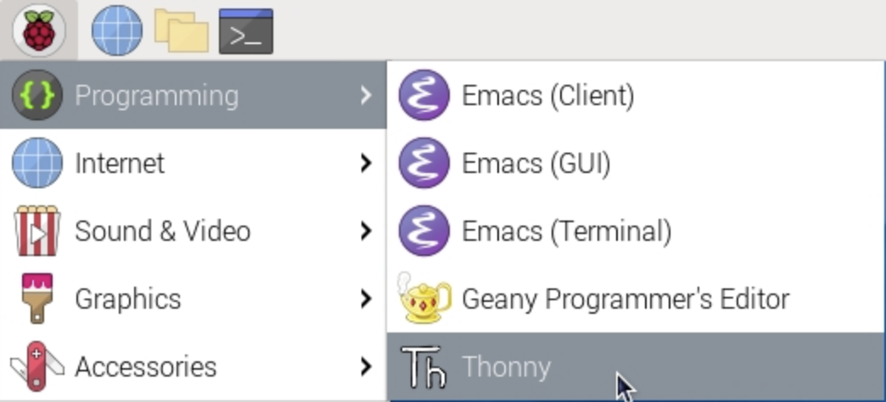
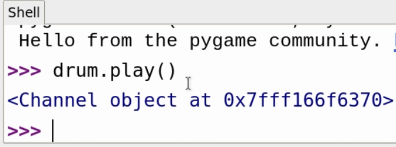

## Play sounds

Next, you will start to write your Python code. Open Thonny.



To start to create the instruments of your music box, you need to test whether Python can play some of the samples that you have copied.

--- task ---

First, import the `pygame` module and initialise it.

```python
import pygame

pygame.init()
```

--- /task ---

--- task ---

Save this file in your `gpio-music-box` directory.

--- /task ---

--- task ---

Choose four sound files that you want to use for your project, for example:

```
drum_tom_mid_hard.wav
drum_cymbal_hard.wav
drum_snare_hard.wav
drum_cowbell.wav
```

--- /task ---

--- task ---

Create a Python object that links to one of these sound files. Give the file its own unique name. For example:

```python
drum = pygame.mixer.Sound("drum_tom_mid_hard.wav")
```

--- /task ---

--- task ---

Run your program, and then in the **shell** type `drum.play()` to hear the sound play.

You may need to check your sound settings and volume to hear the sound.



--- /task ---

--- task ---

Create named objects for your remaining three sounds.

```python
drum = pygame.mixer.Sound("drum_tom_mid_hard.wav")
cymbal = pygame.mixer.Sound("drum_cymbal_hard.wav")
snare = pygame.mixer.Sound("drum_snare_hard.wav")
bell = pygame.mixer.Sound("drum_cowbell.wav")
```

--- task ---

Save and run your code, and test some more sounds in the shell.

```python3
snare.play()
```

--- /task ---

If you don't hear any sound, check that your speakers or headphones are working and that the volume is turned up.
