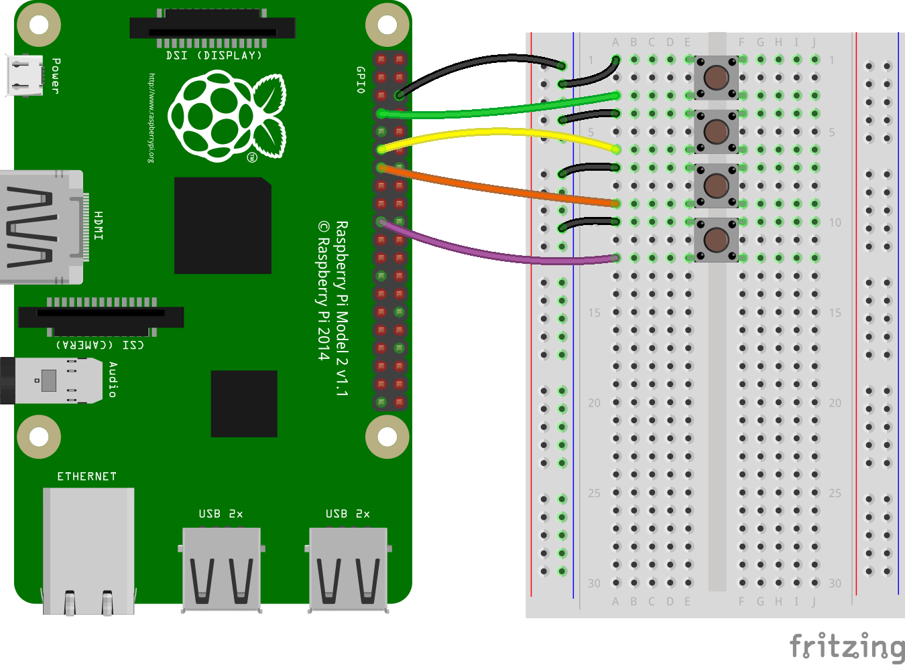

## Connect your buttons

You will need four buttons, each wired to separate GPIO pins on the Raspberry Pi.

[[[rpi-gpio-pins]]]

[[[rpi-gpio-wiring-a-button]]]

--- task ---
Place the four buttons into your breadboard.
--- /task ---

--- task ---
Wire each button to a different numbered GPIO pin. You can choose any pins you like, but you will need to remember the numbers.
--- /task ---

--- hints --- --- hint ---
Wire a single **GND** pin to the negative **blue** rail on the breadboard. Then, wire one leg of each button to this rail. Finally, wire the remaining legs of the buttons to individual GPIO pins.
--- /hint --- --- hint ---
Here's a wiring diagram that might help. In the example, the remaining legs of the buttons are wired to **GPIO 4**, **GPIO 17**, **GPIO 27** and **GPIO 10**.

--- /hint --- --- hint ---
Here's a video that shows how you can wire the buttons.
<video width="560" height="315" controls>
<source src="images/gpio-music-box-5.webm" type="video/webm">
Try using Firefox or Chrome for WebM support
--- /hint --- --- /hints ---

