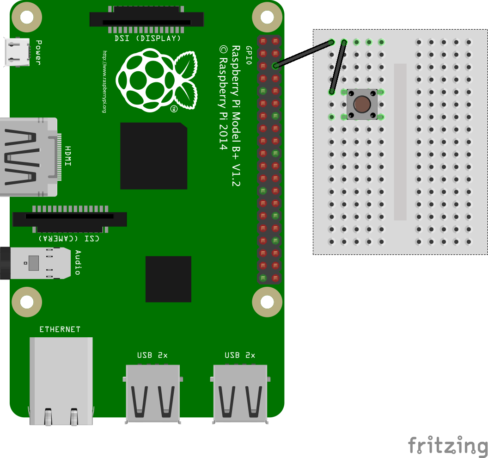

# GPIO Music Box

Wire up a series of buttons that play particular sounds when pressed.

## Getting started

First we'll create a Python program, import the GPIO and PyGame libraries, and play a sample sound file.

1. Boot your Pi and log in with:

    ```
    username: pi
    password: raspberry
    ```

1. Boot to the desktop with the command `startx`

1. Open LXTerminal from the desktop.

1. Type the command `ls` and you should see the files and folders in your home directory.

1. Create a new folder called `musicbox` with the following command:

    ```bash
    mkdir musicbox
    ```

1. Enter the folder with `cd musicbox`

    We're going to need some sample sound files for this project so we'll use the ones from Sonic Pi.

1. Make a copy of Sonic Pi's sound samples folder with the following command:

    ```bash
    cp -r /opt/sonic-pi/etc/samples/ .
    ```

    This will copy the samples folder to your `musicbox` folder.
    
    - `cp` is the *copy* command
    - `-r` means *recursively* which means all the files and folders inside the `samples` folder
    - `/opt/sonic-pi/etc/samples/` is where Sonic Pi keeps its sample sound files
    - The dot (`.`) on the end of the command is the location we'd like to move the files to - and dot (`.`) means "here", which is our `musicbox` folder
    
1. Type `ls` and you'll see the samples folder has been copied over. Type `ls samples` and you'll see a list of `.wav` audo files inside that folder.

1. Create a new Python file with `touch musicbox.py`.

1. Open the Python file in IDLE with the command `sudo idle musicbox.py &`.

    This opens the Python application IDLE with superuser permissions, as you'll need these to use GPIO. Don't forget the ampersand (`&`) on the end as this opens IDLE in a new process and lets you use the command line again.

    You'll see a Python prompt window. It will contain some information about Python then a new line starting with `>>>`. There will be another window, which will be blank.

1. In the blank window, enter the following code to get started:

    ```python
    import pygame.mixer

    pygame.mixer.init()

    drum = pygame.mixer.Sound("samples/drum_tom_mid_hard.wav")
    
    while True:
        drum.play()
    ```

    Here, we import the audio mixer module of the PyGame library and initialise it.

    Then we create a reference to one of the sample sound files.

    The `while True` is a continuous loop containing a command to play the sound file. It will keep playing the drum sound repeatedly until the program is terminated.

1. Save the file with `Ctrl + S` and run with `F5`.

    It should play the drum sound repeatedly.
    
1. Click into the Python prompt window and press `Ctrl + C` on the keyboard to force it to end.

    **If you can't hear the sound, or it's coming out of the wrong speakers, you'll need to change your audio configuration.**
    
    Return to the terminal window and type the following command:

    ```bash
    amixer cset numid=3 1
    ```

    to switch audio to the headphone jack, or

    ```bash
    amixer cset numid=3 2
    ```

    to switch to HDMI.
    
    Then try running your code again and you should hear the drum sound repeatedly. Click into the Python shell and press `Ctrl + C` to stop the program.

## Wire up first button

Now we've configured the audio and tested playing sound in Python, we'll connect the GPIO button.

Firstly, observe the following GPIO diagram. You'll be using a single ground pin (marked `GND`) and several GPIO pins (marked `GPIO`):

|            |            |
|-----------:|:-----------|
|    3V3     | 5V         |
|  **GPIO2** | 5V         |
|  **GPIO3** | GND        |
|  **GPIO4** | **GPIO14** |
|        GND | **GPIO15** |
| **GPIO17** | **GPIO18** |
| **GPIO27** | GND        |
| **GPIO22** | **GPIO23** |
|        3V3 | **GPIO24** |
| **GPIO10** | GND        |
|  **GPIO9** | **GPIO25** |
| **GPIO11** | **GPIO8**  |
|        GND | **GPIO7**  |
|        DNC | DNC        |
|  **GPIO5** | GND        |
|  **GPIO6** | **GPIO12** |
| **GPIO13** | GND        |
| **GPIO19** | **GPIO16** |
| **GPIO26** | **GPIO20** |
|        GND | **GPIO21** |

Note that if you have an older Raspberry Pi model you'll only have 26 pins but they have the same layout, starting at the top row (`3V3` and `5V` and ending at `GND` and `GPIO7`).
    
1. Find a ground pin (marked `GND`) on the diagram of the Raspberry Pi's pin layout above.

1. Attach a wire to a ground pin on the Raspberry Pi and connect it to the ground rail on your breadboard like so:

    

1. Place the button on the breadboard and connect one of its feet to the ground rail.

1. Connect the button's other foot (on the same side) to GPIO pin 2 like so:

    
    
    If you're using a mini breadboard without a designated ground rail, you'll have to use one of the rows as the ground rail. Connect a row to a ground pin and the other points in that row will be connected to ground like so:

    

## Connect first button to sound file

Now we've connected a GPIO button, we'll make the sound play when the button is pressed.

1. Return to the code window and amend the code to add the GPIO library and set up pin 2, so it looks like this:

    ```python
    import pygame.mixer
    import RPi.GPIO as GPIO

    pygame.mixer.init()
    GPIO.setmode(GPIO.BCM)
    GPIO.setwarnings(False)

    GPIO.setup(2, GPIO.IN, GPIO.PUD_DOWN)

    drum = pygame.mixer.Sound("samples/drum_tom_mid_hard.wav")
    ```

    This sets up GPIO pin 2 as an input, so you can trigger an event with the button.

1. Now add a function for playing the sound. This will be the code than runs when the button is pressed:

    ```python
    def play(pin):
        print("playing")
        drum.play()
    ```

    The `print` will tell you when the function has been called, so you know what's going on.

1. Create a GPIO event that will call the `play` function when the button is pressed:

    ```python
    GPIO.add_event_detect(2, GPIO.FALLING, play, 100)
    ```

    The arguments passed to the function are:
    
    - the GPIO pin number (`2`)
    - the type of voltage change (`FALLING`)
    - the function to be used as the callback (`play`)
    - the amount of time allowed between button presses (`100` milliseconds)

1. Add a line to print `ready` once it's all been set up, and add a `while True` loop to wait for a button press:

    ```python
    print("ready")

    while True:
        pass
    ```

1. Run the program again and once you see `ready` printed to the screen, press the button and you should hear the drum sound played. Each time you press the button it should print `playing` to the screen and play the sound.

    If you do not see the word `playing` when you press the button, check you have it wired to the ground rail and pin 2, and that the cables are securely connected.

## Add second button

Now that we've added an event for the first button to trigger the drum sound, we'll connect a second button and map that to a different sound.

1. Add a second button to the breadboard and wire it up to the ground rail and to GPIO pin 3 like so:

    

1. In the code, add a cymbal sound in the same way:

    ```python
    drum = pygame.mixer.Sound("samples/drum_tom_mid_hard.wav")
    cymbal = pygame.mixer.Sound("samples/drum_cymbal_open.wav")
    ```

    We also need to perform the `GPIO.setup()` on pin 3 as well as pin 2. Rather than just copy this line, we'll automate the process.

    Normally we'd use a list like `pins = [2, 3, 4, 5]` and use a loop to run the setup for each item in the list. However, as this time we also need a list of sounds that correspond to GPIO pins, we'll use another data structure called a *dictionary* which is used to store relationships between items.

1. After the `cymbal` line, create a dictionary mapping the two GPIO pins to their respective sounds, like so:

    ```python
    sound_pins = {
        2: drum,
        3: cymbal,
    }
    ```

    This means you can look up which sound to play by passing in the pin number; for example `sound_pins[2]` yields `drum` and `sound_pins[3]` yields `cymbal`.

    Now where we previously had the `GPIO.setup()` line for pin 2, we'll use a loop to set up all the pins in the `sound_pins` dictionary.

1. Use the following loop to set up each pin:

    ```python
    for pin in sound_pins:
        GPIO.setup(pin, GPIO.IN, GPIO.PUD_DOWN)
    ```

    Looping over a dictionary like this yields the dictionary keys (the left hand side), and passing a key into a dictionary yields the corresponding value. For the pin setup all we need is the pin numbers.

    The other thing we want to do for each pin is set up the event detection.
    
    We *could* write a new function to play each particular sound, and add each event detection separately mapped to the appropriate function. However, it is possible to use a single function that determines which sound to play according to which pin was triggered.

1. Move the previously used `add_event_detect()` line into this loop, replacing the hard-coded value of `2` for the loop variable `pin`:

    ```python
    for pin in sound_pins:
        GPIO.setup(pin, GPIO.IN, GPIO.PUD_DOWN)
        GPIO.add_event_detect(pin, GPIO.FALLING, play, 100)
    ```

    Now the `play` function will be called when pins `2` or `3` are triggered (by their connected buttons being pressed). However, we need to amend the `play` function to make it play the right sound according to which button was pressed.

1. Amend the `play` function like so:

    ```python
    def play(pin):
        sound = sound_pins[pin]
        print("playing note from pin %s" % pin)
        sound.play()
    ```

    Because the event detection callback sends the GPIO pin number to the `play` function, we can look it up in the `sound_pins` dictionary, set `sound` to the appropriate sound and then play it.

1. Now run the program again and when you see the ready message, try pressing each button. Different sounds should be played when each button is pressed.

## Connect more buttons

Now we've done all the hard work, it's really easy to connect more buttons to make more sounds!

For each extra button, all you need to do is:

1. Connect the button to the breadboard and wire it to the ground rail and another GPIO pin. Make sure it's a pin marked GPIO in the pin diagram above.

1. Add a reference to the new sound file:

    ```python
    bell = pygame.mixer.Sound("sounds/elec_bell.wav")
    snare = pygame.mixer.Sound("sounds/elec_hi_snare.wav")
    ```

1. Add the pin number and sound variable to the `sound_pins` dictionary:

    ```python
    sound_pins = {
        2: drum,
        3: cymbal,
        4: bell,
        14: snare,
    }
    ```

    And that's it! Re-run the program and the new buttons should make new sounds!

## What next?

- Try some more sounds from the `sample` folder.

- Leaving the code as it is, you could make a presentation box with big colourful buttons that don't need a breadboard, and attach speakers to the side.

- Try recording your own sounds and use them instead!
