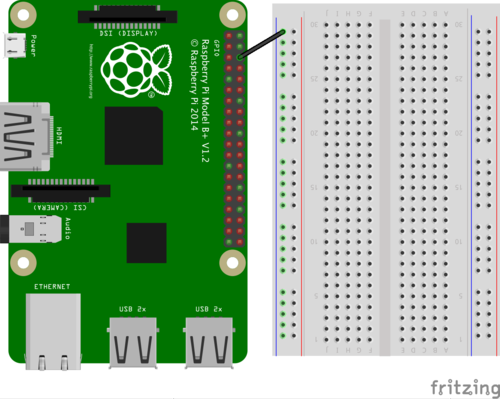
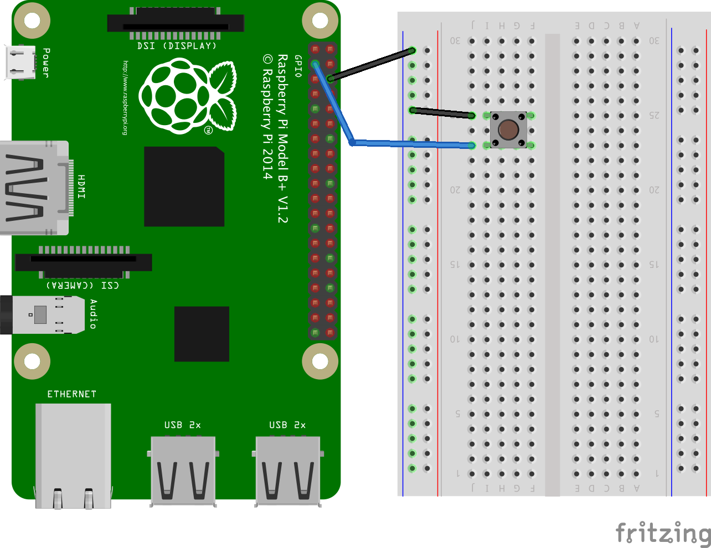
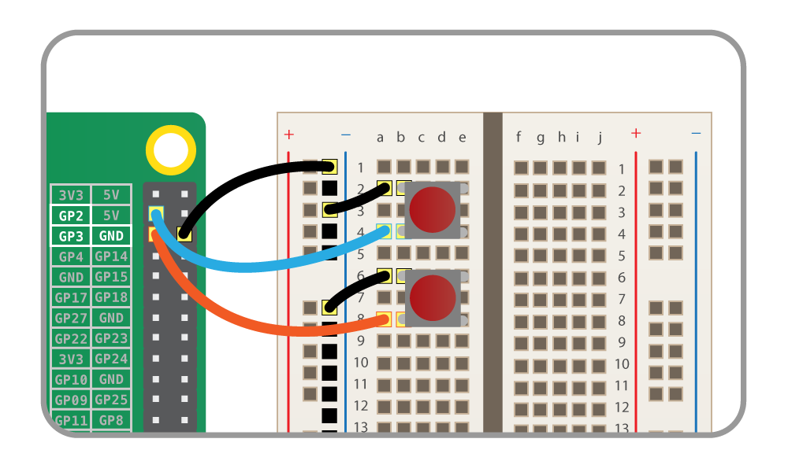

# GPIO Music Box

Wire up a series of buttons that play particular sounds when pressed.

## Getting some sample sounds

First you'll create a Python program, import the bits of the PyGame library you'll need, and play a sample sound file.

1. Open a Terminal window from the desktop or application menu.

1. Type the command `ls` and you should see the files and folders in your home directory.

1. Create a new folder called `musicbox` with the following command:

    ```bash
    mkdir musicbox
    ```

1. Enter the folder with `cd musicbox`

    You're going to need some sample sound files for this project so you'll use the ones from Sonic Pi.

1. Make a copy of Sonic Pi's sound samples folder with the following command:

    ```bash
    cp -r /opt/sonic-pi/etc/samples/ .
    ```

    This will copy the samples folder to your `musicbox` folder.

    - `cp` is the *copy* command
    - `-r` means *recursively* which means all the files and folders inside the `samples` folder
    - `/opt/sonic-pi/etc/samples/` is where Sonic Pi keeps its sample sound files
    - The dot (`.`) on the end of the command is the location you're going to move the files to; dot (`.`) means "here", which is the `musicbox` folder

1. Type `ls` and you'll see the samples folder has been copied over. Type `ls samples` and you'll see a list of `.flac` audio files inside that folder.

1. The `.flac` format is fine for Sonic Pi, but to use them in Python you'll need to convert them to `.wav` files. First you'll need to switch into the `samples` directory, by typing:

    ``` bash
    cd ~/musicbox/samples
    ```

1. Now you can use `avconv` to convert all the files. This line of bash converts the file from `.flac` to `.wav` and keeps the same base file name.

    ``` bash
    for f in *.flac; do avconv -i "$f" "${f%.flac}.wav"; done
    ```

1. Lastly, you can remove the `.flac` files from the **copy** of the `samples` directory

    ``` bash
    rm *.flac
    ```

## Playing sounds with Python

1. Open Python 3 (IDLE) from the main menu:

    

1. Click `File > new file` and save the new file with `Ctrl + S`. Save it as `musicbox.py` in your `musicbox` folder.

1. In the blank window, start by importing the PyGame mixer and the Sound module:

    ```python
    import pygame.mixer
    from pygame.mixer import Sound
    ```

1. Next, add a line to initialise the PyGame mixer:

    ```python
    pygame.mixer.init()
    ```

1. Now create a `Sound` object for one of the sample sounds, for example a drum sound:

    ```python
    drum = Sound("samples/drum_tom_mid_hard.wav")
    ```

1. Finally, add a loop to play the sound continuously:

    ```python
    while True:
        drum.play()
    ```

1. Save the file with `Ctrl + S` and run with `F5`.

    It should play the drum sound repeatedly.

    **If you can't hear the sound, or it's coming out of the wrong speakers, you'll need to change your audio configuration.**

    Return to the terminal window and type the following command:

    ```bash
    amixer cset numid=3 1
    ```

    to switch audio to the headphone jack, or

    ```bash
    amixer cset numid=3 2
    ```

    to switch to HDMI.

    Then try running your code again and you should hear the drum sound repeatedly. Click into the Python shell and press `Ctrl + C` to stop the program.

1. Click into the Python prompt window and press `Ctrl + C` on the keyboard to force it to end.

## Wire up the first button

Now you've configured the audio and tested playing sound in Python, you'll connect the GPIO button.

1. Firstly, observe the following GPIO diagram. You'll be using a single ground pin (marked `GND`) and several GPIO pins (marked `GPIO`):

    |            |            |
    |-----------:|:-----------|
    |    3V3     | 5V         |
    |  **GPIO2** | 5V         |
    |  **GPIO3** | GND        |
    |  **GPIO4** | **GPIO14** |
    |        GND | **GPIO15** |
    | **GPIO17** | **GPIO18** |
    | **GPIO27** | GND        |
    | **GPIO22** | **GPIO23** |
    |        3V3 | **GPIO24** |
    | **GPIO10** | GND        |
    |  **GPIO9** | **GPIO25** |
    | **GPIO11** | **GPIO8**  |
    |        GND | **GPIO7**  |
    |        DNC | DNC        |
    |  **GPIO5** | GND        |
    |  **GPIO6** | **GPIO12** |
    | **GPIO13** | GND        |
    | **GPIO19** | **GPIO16** |
    | **GPIO26** | **GPIO20** |
    |        GND | **GPIO21** |

    *Note that if you have an older Raspberry Pi model you'll only have 26 pins but they have the same layout, starting at the top row (`3V3` and `5V` and ending at `GND` and `GPIO7`).*

1. Find a ground pin (marked `GND`) on the diagram of the Raspberry Pi's pin layout above.

1. Attach a wire to a ground pin on the Raspberry Pi and connect it to the ground rail on your breadboard like so:

    

1. Place the button on the breadboard and connect one of its feet to the ground rail.

1. Connect the button's other foot (on the same side) to GPIO pin 2 like so:

    

## Connect first button to sound file

Now you've connected a GPIO button, you'll make the sound play when the button is pressed.

1. Return to the code window and add another two lines to the top section of imports:

    ```python
    from gpiozero import Button
    from signal import pause
    ```

    *GPIO Zero provides an interface for many common GPIO components. The Button class contains everything you need to control anything with your push button.*

1. Add a line beneath your mixer init to create an instance of your button on pin 2:

    ```python
    button = Button(2)
    ```

    *This sets up GPIO pin 2 as an input device with the capabilities of a button, so you can trigger an event with by pressing the button.*

1. Now tell the button to run the sound's `play` function when it is pressed. Add the following line:

    ```python
    button.when_pressed = drum.play
    ```

1. Add a line to pause the program so that it will continue to wait for the button to be pressed.

    ```python
    pause()
    ```

    This goes at the very end of the file.

1. Run the program again, then press the button and you should hear the drum sound played. Each time you press the button it should play the sound.

    *If you do not hear the sound when you press the button, check you have it wired to the ground rail and pin 2, and that the cables are securely connected.*

## Add a second button

Now that you've added an event for the first button to trigger the drum sound, you'll connect a second button and map that to a different sound.

1. Add a second button to the breadboard and wire it up to the ground rail and to GPIO pin 3 like so:

    

1. You now need to create a `Button` object on pin 3 as well as pin 2. Rather than just copy this line, you will automate the process.

    Normally you'd use a list like `pins = [2, 3, 4, 5]` and use a loop to run the setup for each item in the list. However, as this time you also need a list of sounds that correspond to GPIO pins, you'll use another data structure called a *dictionary* which is used to store relationships between items.

    Remove the `drum = ` line, and in its place, create a dictionary mapping the two GPIO pins to their respective sounds, like so:

    ```python
    sound_pins = {
        2: Sound("samples/drum_tom_mid_hard.wav"),
        3: Sound("samples/drum_cymbal_open.wav"),
    }
    ```

    *This means you can look up which sound to play by passing in the pin number; for example `sound_pins[2]` yields the drum sound object, and `sound_pins[3]` yields the cymbal sound.*

1. Now where you previously had the `button = Button(2)` line for pin 2, you'll use a technique called *list comprehension* to create a list of buttons on all the pin numbers in the `sound_pins` dictionary:

    ```python
    buttons = [Button(pin) for pin in sound_pins]
    ```

    Now `buttons` contains a list of `Button` objects, on pins 2 and 3.

    *Looping over a dictionary like this yields the dictionary keys (the left hand side), and passing a key into a dictionary yields the corresponding value. For the pin setup all you need is the pin numbers.*

1. Now you have a list of `Button` objects, you'll need to tell each button to play a sound when pressed. Rather than write a new function to play each particular sound, you can loop over the `buttons` list and look up each one in the dictionary. below the creation of the `buttons` list, add the following loop:

    ```python
    for button in buttons:
        sound = sound_pins[button.pin.number]
        button.when_pressed = sound.play
    ```

    *Each Button object has a `pin` property which allows you to look up which GPIO pin it's connected to. Here you get the pin number from each button, look up which sound corresponds to the pin number and set it to `button.when_pressed`*

1. You can now delete the `play` function as it is no longer used!

1. Now run the program again and try pressing each button. Each button should play its own sound.

## Connect more buttons

Now you've done all the hard work, it's really easy to connect more buttons to make more sounds!

For each extra button, all you need to do is:

1. Connect the button to the breadboard and wire it to the ground rail and another GPIO pin. **Make sure it's a pin marked GPIO in the pin diagram above.**

1. Add the pin number and sound reference to the `sound_pins` dictionary:

    ```python
    sound_pins = {
        2: Sound("samples/drum_tom_mid_hard.wav"),
        3: Sound("samples/drum_cymbal_open.wav"),
        4: Sound("samples/elec_bell.wav"),
        14: Sound("samples/elec_hi_snare.wav"),
    }
    ```

    And that's it! Re-run the program and the new buttons should make new sounds!

## What next?

- Try some more sounds from the `samples` folder.
- Leaving the code as it is, you could make a presentation box with big colourful buttons that don't need a breadboard, and attach speakers to the side.
- Try recording your own sounds and use them instead!
